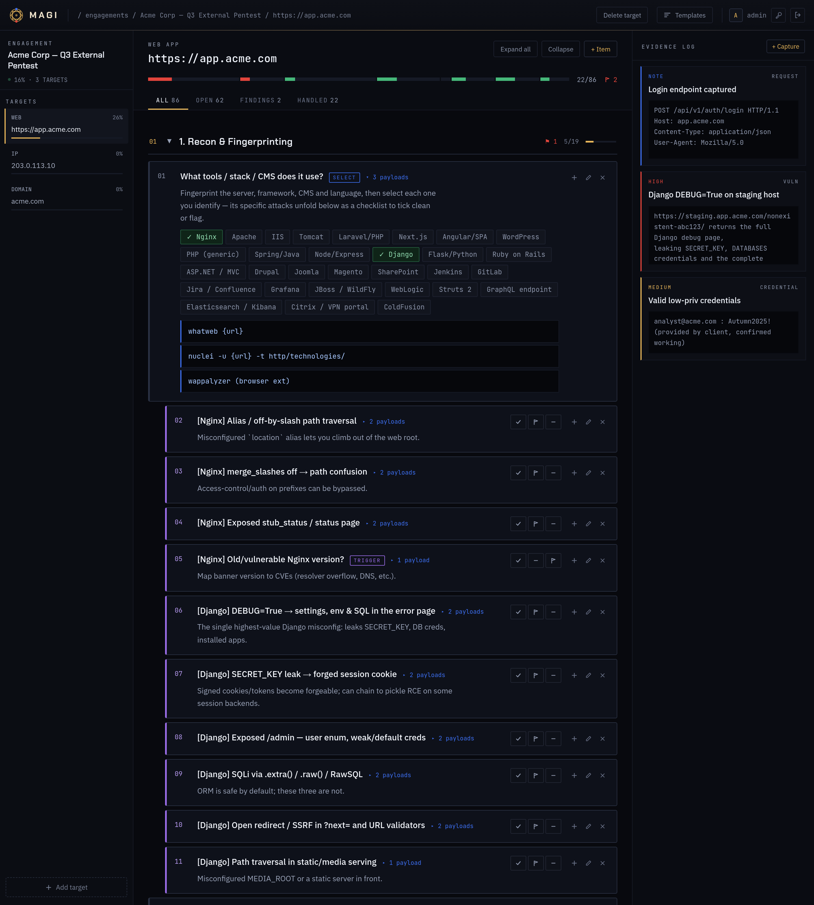
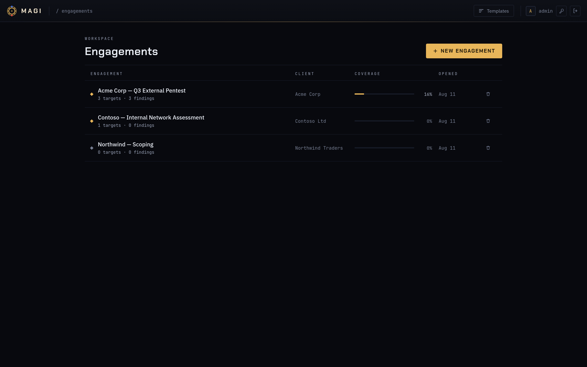
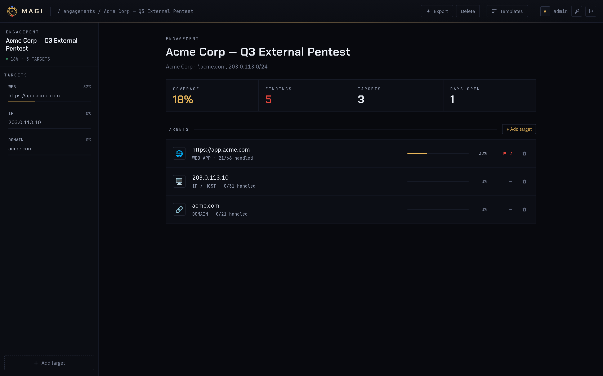
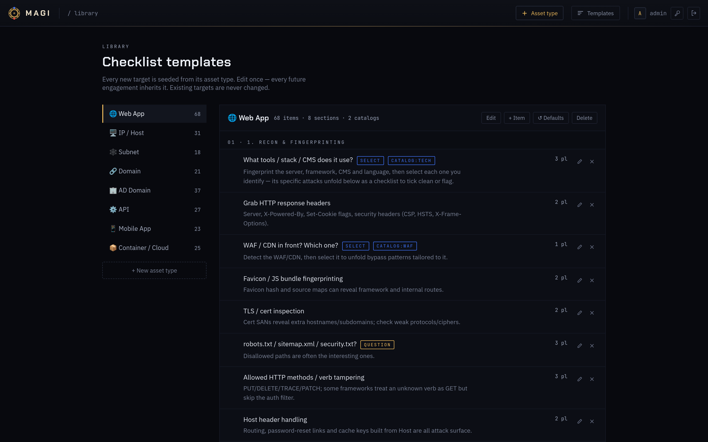
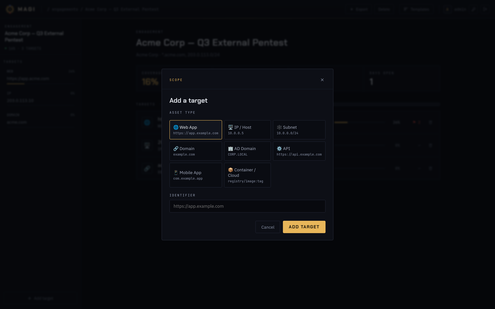
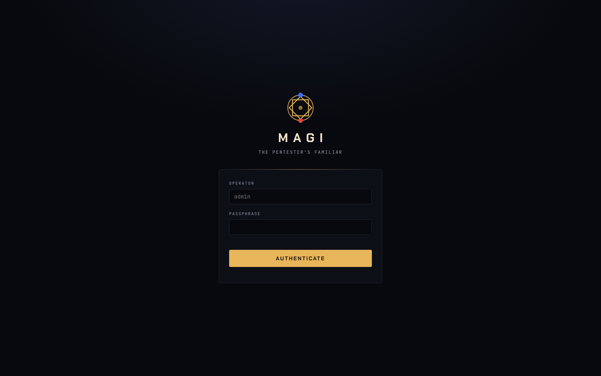
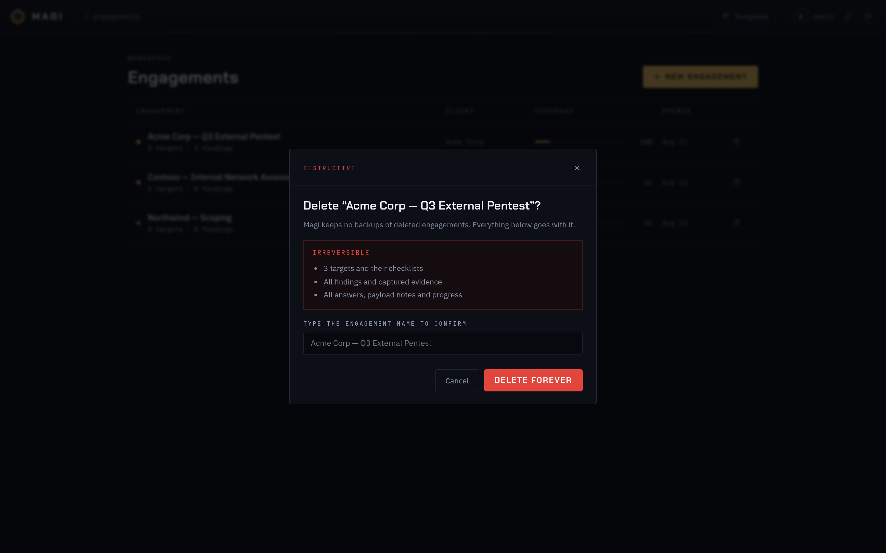

# MAGI

*The pentester's familiar.*

Engagement-based checklist, target tracker and evidence log. **Web app + CLI**, sharing one local SQLite DB.
Add assets (Web, IP, Subnet, Domain, AD, API, Mobile, Container); each gets a tailored
attack checklist. Answer trigger questions ("Is there a login?") and the app spawns the
matching follow-up checklist (login/register/upload/injection attacks…). Record findings
(raw HTTP requests, creds, vulns) and export a Markdown report.

> For authorized security testing only.

## Screenshots

The working screen: targets on the left, checklist in the middle, evidence log on the right.
Selecting a fingerprinted stack unfolds its own attack checklist inline; triggers spawn
follow-up checklists underneath themselves.



| | |
|---|---|
|  |  |
| Engagements — coverage and findings at a glance | One engagement — stats and its targets |
|  |  |
| Template library — edit what new targets are seeded from | Adding a target |
|  |  |
| Sign-in | Destructive actions spell out what they take |

## Run it

```bash
npm install
npm start          # http://localhost:4173
```

No native build step: uses Node's built-in `node:sqlite` (Node 22.5+). Data lives in `./data/magi.db` (an existing `checklister.db` is picked up automatically).

### Login

The first run creates **`admin` / `admin`**. The desktop app opens no port at all, so this
is a lock screen rather than a network control — but change it from the account bar (🔑)
anyway, which also signs out every other session. Set your own up front with:

```bash
MAGI_USER=me MAGI_PASS=a-long-passphrase npm start
```

`magi serve` **refuses to bind a non-loopback address while the password is still the
default**, so an exposed instance can never ship with `admin/admin`.

### Where it listens

The DB holds client credentials, raw requests and findings, so the server **binds to
`127.0.0.1` only** by default. To share it on a trusted network:

```bash
MAGI_HOST=0.0.0.0 npm start
```

Do that only with a strong password set — it prints a warning when it is not localhost-bound.
The SQLite file itself is unencrypted; treat `./data/` as client-confidential and keep it out
of git (`.gitignore` already excludes it).

Other env vars: `MAGI_PORT` (default 4173), `MAGI_DB`, `MAGI_SESSION_DAYS` (default 30).
The old `CHECKLISTER_*` names are still accepted, so existing scripts keep working.

### Template editor

The **✎ Templates** button (top-right) opens an editor for everything new assets are built from:

- **Asset types** — add, rename or delete a type (e.g. a Thick Client type of your own).
- **Default checklist items** — sections, detail text, payloads, item kind.
- **Follow-up checklists** — the checklist a `trigger` item spawns when you answer "yes".
- **Catalogs** — the per-option checklist a `select` item unfolds (tech stack, WAF, …).

Wiring is by key: a trigger's *spawns* value matches a follow-up checklist's key; a select's
*catalog* plus an option key matches a catalog entry. **↺ Restore defaults** reinstalls the
shipped content for a type, discarding your template edits for it.

Editing a template never touches assets you already created — it applies to newly-added assets.
Both the web app and the CLI build new assets from these same editable templates.

## Desktop app

Magi runs as a real application window — **no port is opened and no browser is involved**.
The UI is served over a private `magi://` scheme handled inside the process, and requests
are dispatched straight into Express without a socket, so nothing is reachable from the
network even on localhost.

```bash
npm run app          # from a checkout
magi                 # installed
```

## Install

### Arch Linux (recommended here)

Uses the system Electron, so the package stays around **750 KB**.

```bash
npm run pkg                                   # or: cd packaging && makepkg -f
sudo pacman -U packaging/magi-0.1.0-1-any.pkg.tar.zst
```

### Debian / Ubuntu

Debian has no Electron package, so the `.deb` bundles its own copy — **~100 MB**.

```bash
npm run build && npm run pkg:deb
sudo apt install ./dist/installers/magi_0.1.0_amd64.deb
```

### Any Linux — portable AppImage

```bash
npm run build && npm run pkg:appimage
chmod +x dist/installers/Magi-0.1.0.AppImage
./dist/installers/Magi-0.1.0.AppImage
```

### macOS

Cross-built from Linux, both architectures:

```bash
npm run build && npm run pkg:mac
# dist/installers/Magi-0.1.0-mac.zip         Intel
# dist/installers/Magi-0.1.0-arm64-mac.zip   Apple Silicon
```

These are **unsigned and unnotarised**, and were built on Linux — I have no Mac to
test them on. Gatekeeper will refuse them on first launch; unzip, move `Magi.app`
to /Applications, then either right-click → Open, or:

```bash
xattr -dr com.apple.quarantine /Applications/Magi.app
```

`npm run pkg:all` builds the deb, the AppImage and both macOS zips in one go. All
targets except the Arch package need `electron` and `electron-builder` from npm
(`npm install` pulls them in as dev dependencies).

### Everything the packages give you

```bash
magi                                  # the app window
magi projects                         # CLI
magi add-asset 1 web https://app.acme.com
magi export 1 > report.md
magi serve                            # local web server instead, http://127.0.0.1:4173
```

Data lives in `~/.local/share/magi/magi.db` (honours `XDG_DATA_HOME`). A source
checkout keeps its database in `./data` instead, so the two never collide.

### Single-file executable

`node build/build.mjs --exe` attempts a standalone binary via Node's Single Executable
Application support. On the current toolchain postject produces a segfaulting binary —
a hello-world SEA fails the same way — so the build verifies the result and deletes it
rather than shipping something broken.

## CLI

```bash
node cli.js new-project "Acme — Q3 Pentest" "Acme Corp"
node cli.js projects
node cli.js add-asset 1 web https://app.acme.com
node cli.js add-asset 1 ip 10.0.0.5
node cli.js show 1
node cli.js set 3 done
node cli.js export 1 > report.md
node cli.js reseed all          # reinstall shipped defaults (after pulling new content)
```

`node cli.js` with no args prints all commands.

## Asset types & content

Roughly 650 checklist items ship across 8 types, split between the base checklist, the
follow-up checklists triggers spawn, and the catalog entries selects unfold. Coverage is
cross-checked against the OWASP Web Application Security Testing Checklist, the OWASP
MASVS for mobile, and the OWASP API Security Top 10 (2023).

| Type | Covers |
|------|--------|
| **web** | recon/fingerprint, discovery, auth, injection, upload, access control, session, protocol/cache/infra and cryptography — with deep-dives for login, registration, password reset, MFA, OAuth/SSO, upload, injection, GraphQL, race conditions, cache poisoning, 403 bypass, payment/checkout and non-production exposure |
| **ip** | full/UDP scans, OS guess, per-service triggers (SSH, FTP, SMB, HTTP, RDP, DB, SNMP, LDAP, SMTP, NFS, Redis/Elastic, WinRM), exploitation and post-exploitation with a local-privesc deep-dive |
| **subnet** | host discovery, sweeps, poisoning/relay, segmentation and egress testing, triage |
| **domain** | DNS/OSINT, ASN, subdomain enum + takeover, email posture, public exposure & leaks |
| **ad** | enumeration + BloodHound, AS-REP/Kerberoast/spray, escalation and lateral movement, domain compromise — with deep-dives for AD CS (ESC1-16), delegation, NTLM coercion/relay and ACL abuse |
| **api** | surface mapping and the full OWASP API Security Top 10 (2023), including sensitive business-flow abuse (API6), with JWT and GraphQL deep-dives |
| **mobile** | static, dynamic, backend and privacy phases mapped to OWASP MASVS — storage, crypto/key management, network config, IPC, WebViews, deep links, resilience (attestation, debugger/emulator detection) and privacy controls |
| **container** | image & supply chain, runtime/escape, Kubernetes, cloud identity & blast radius |

**Tech catalogs**: selecting a fingerprinted stack unfolds attacks specific to it — 30 entries
covering Nginx/Apache/IIS/Tomcat, Laravel, Next.js, Angular, WordPress, Django, Flask, Rails,
ASP.NET, Drupal, Joomla, Magento, SharePoint, Jenkins, GitLab, Jira/Confluence, Grafana,
JBoss, WebLogic, Struts, ColdFusion, Elastic, Citrix and GraphQL — plus 8 WAF/CDN bypass sets.

Add your own content in the **✎ Templates** editor (no restart needed), or edit
`seed/templates.js` and run `node cli.js reseed <type>` to reinstall it as the default.
You can also add custom items and findings per-asset directly in the UI.

## Project layout

```
server.js            Express API + static host
db.js                node:sqlite schema, seeding & auth hashing
seed/templates.js    shipped checklist content (the factory default)
cli.js               command-line interface
public/              vanilla-JS single-page UI
data/magi.db         your data — client-confidential, gitignored
public/fonts/        self-hosted webfonts (Magi never calls out to a CDN)
electron/            desktop app: window, magi:// scheme, socket-free Express dispatch
build/build.mjs      bundles everything into dist/
packaging/           PKGBUILD, launcher, icon, desktop entry
```

Templates live in the DB (`tpl_types`, `tpl_items`, `tpl_groups`, `tpl_group_items`) once
seeded, which is what makes them editable in the UI. `seed/templates.js` is the source those
tables are populated from on first run and on `reseed`.
